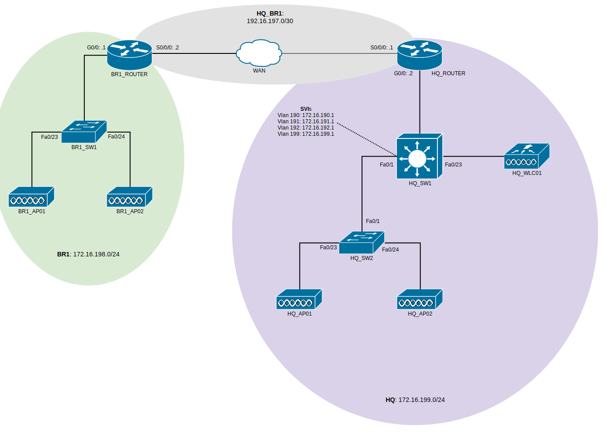

#Wireless Networks Group Project

## What's going on?
This repositiory contains the configuration files for each cisco device
used in the project.

The project will be completed in a number of stages, each improving on the last.
This page contains a topology diagram of the network for the current stage, and
a list of checkpoints for the stage.

## Topology

## Stage 1

+ Basic config on devices
+ Enable secret `ithurtswhenIP`
+ Local user on each device: user `LANDownUnder` pass `ithurtswhenIP`
+ Telnet configured on each device (not SSH because we'd have to regenerate
  keys all the time)
+ Fa0/10 - 14 on `HQ_SW2` should be access ports on Vlan 199 &mdash; so we can
  plug PCs in and telnet into devices.
+ Static routes on `HQ_ROUTER`, `BR1_ROUTER` and `HQ_SW1` so routing works between
  networks.
+ `HQ_SW1` acting as DHCP server for VLANS 190, 192, 192 and 199.
+ `BR1_ROUTER` acting as DHCP server for network 172.16.198.0/24.
+ Excluded addresses .1 - .29 for each DHCP pool.
+ `HQ_ROUTER` acting as NTP server.
+ Unused ports on switches should be ahutdown and set as access ports on VLAN 999
  which is disallowed on all trunks (ie, Blackhole VLAN).
+ `HQ_SW1` as VTP server for HQ LAN. VTP domain: `LANDOWNUNDER` vtp pass: `ithurtswhenIP`.
+ APs should get addresses from DHCP and connect to `HQ_WLC01`.
+ SSIDS `GUEST`, `STAFF` and `STUDENT` should be broadcast by all APs.
+ `GUEST` traffic on VLAN 190.
+ `STAFF` traffic on VLAN 191.
+ `STUDENT` traffic on VLAN 192.
+ Only VLANs 190, 191, 192 and 199 allowed on trunks.
